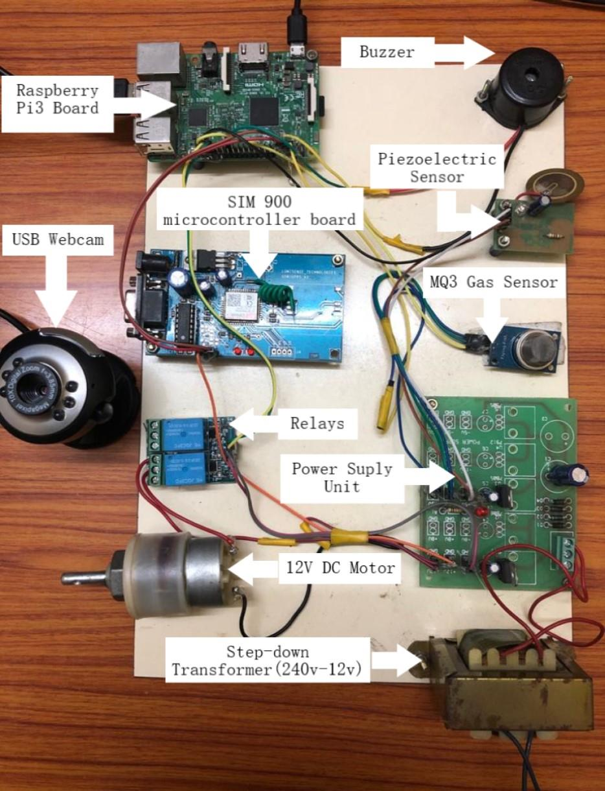
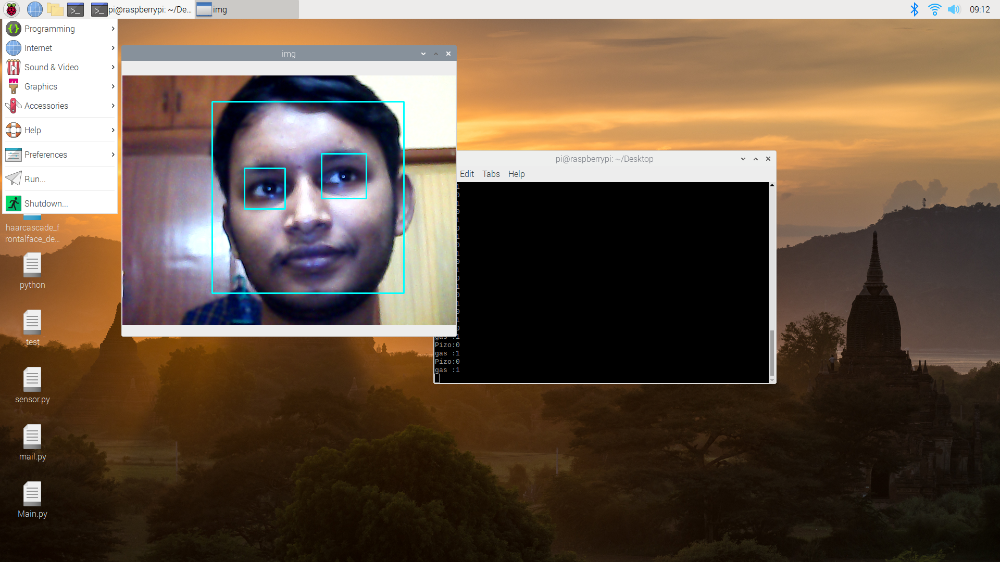
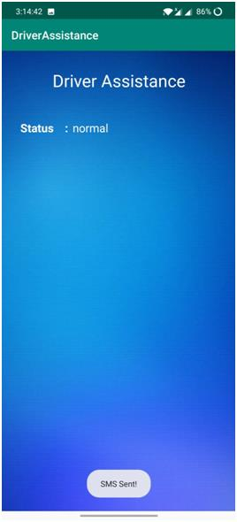
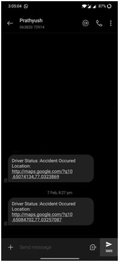

# Driver-Assistance-System
This repository contains the code and the research paper related to the Driver assistance project which is funded by my college.
##Motivation:
Now-a-days lot of accidents occur due to alcohol consumption and drowsiness of the driver.To overcome this we have come up with a solution that alerts the driver using buzzer if the driver is found to be sleepy.It also detects whether the driver has consumed alcohol.In case an accident occurs,this system sends the location of the vehicle to the concerned persons.
##Hardware:

The Raspberry pi is connected to laptop using remote desktop connection app on windows 10.
Both the laptop and raspberry pi are connected to same JIO network.
##Output:
  When the eyes are open:

  When the eyes are closed:

When alcohol is detected,mail is sent to the concerned persons.Settings has to be changed for the email id which is used to send the alert.

When an accident occurs:

While using the Android App , permissions such as sms and location should be enabled.

  
